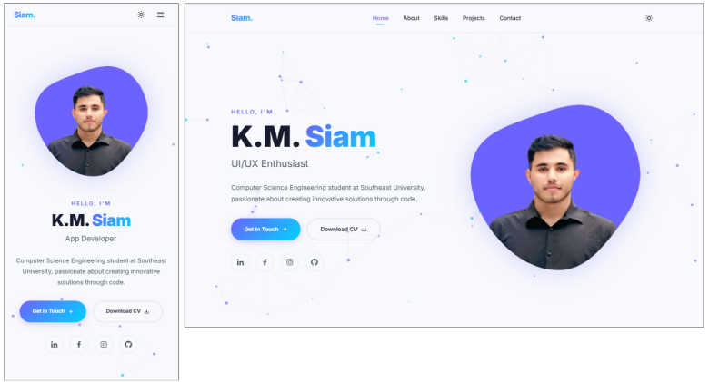

# K.M. Siam - Personal Portfolio Website

[](https://developer.mozilla.org/en-US/docs/Web/HTML)
[](https://developer.mozilla.org/en-US/docs/Web/CSS)
[](https://developer.mozilla.org/en-US/docs/Web/JavaScript)
[](https://vercel.com/)
[](https://opensource.org/licenses/MIT)
[](Portfolio_Report.pdf)

> A premium, modern, and fully responsive personal portfolio website showcasing my academic journey, technical skills, and completed projects as a Computer Science & Engineering student at Southeast University.

---

## 📸 Preview



---

## 🌟 Key Features

- **Fluid Responsive Layout** – Handcrafted using CSS Flexbox and CSS Grid, fully optimized for seamless viewing across smartphones, tablets, laptops, and wide desktop displays.
- **Dynamic Typing Animation** – Interactive hero subtitle cycling through core titles (`CSE Student`, `Web Developer`, `Problem Solver`, `UI/UX Enthusiast`, `App Developer`).
- **Interactive Theme Engine** – Native dark and light mode toggle with state persistence across sessions using browser `localStorage`.
- **Canvas Particle Backdrop** – High-performance particle network rendered dynamically on an HTML5 `<canvas>` with custom repulsion physics responding to mouse movements.
- **Tabbed Skills & Education Dashboard** – Toggleable tabs grouping professional technical skills by category and presenting a chronologically organized educational history.
- **Animated Statistical Counters** – Numerical statistics (Completed Projects, Programming Languages, Experience Months) that scroll-trigger and count up using optimized request-frame loops.
- **Integrated Contact Form** – Serverless contact processing using a Formspree secure endpoint, equipped with validation and spam control.
- **CV Download Module** – Quick access to a downloadable PDF curriculum vitae stored directly within the local assets.
- **Academic Project Report** – Includes a comprehensive, Microsoft Word-compatible [Portfolio_Report.pdf](Portfolio_Report.pdf) documenting the website objectives, features, system architecture, validation protocols, testing specifications, development phases, and technical reflection.

---

## 🛠️ Technology Stack

- **Markup & Semantics**: `HTML5` (for structured, accessible, and SEO-friendly document layout)
- **Styling & Presentation**: `CSS3` (Custom CSS variables, grid systems, smooth transitions, keyframe animations, and light/dark theme color schemes)
- **Interactive Logic**: `Vanilla JavaScript (ES6)` (DOM manipulation, canvas animations, form handling, and theme state management)
- **Iconography**: `Boxicons CDN` (consistent SVG-based iconography)
- **Forms Handling**: `Formspree Service` (third-party serverless form processor)
- **Media Delivery**: `Cloudinary CDN` (fast asset serving for portfolio screenshots)

---

## 📱 Portfolio Sections

1. **Home / Hero**: Introduces name, typing titles, call-to-actions (Get in Touch, Download CV), and social connections.
2. **About Me**: Brief bio, professional summary, and key statistical milestones with counting animations.
3. **Skills & Education**: A tabbed structure displaying technical stacks (Frontend, Backend, Tools) alongside academic credentials.
4. **Projects / Work**: An interactive visual grid showcasing web, mobile, and software development projects with hover effects and detailed tags.
5. **Contact**: Complete contact details (mobile, email, address) paired with a responsive message dispatch form.

---

## 📁 Project Structure

```
portfolio-responsive-complete-main/
├── index.html              # Main webpage and layout entry point
├── preview.png             # Visual preview of the portfolio page
├── README.md               # Technical project documentation
├── Portfolio_Report.pdf    # Academic project report (PDF version)
├── assets/
│   ├── css/
│   │   └── styles.css      # Core stylesheet containing variables, layouts, and animations
│   ├── js/
│   │   └── main.js         # Interactive features, canvas particles, and typing script
│   ├── img/
│   │   ├── about.jpg       # Profile picture for the About section
│   │   └── perfil.png      # Avatar image used inside the Hero blob
│   └── pdf/
│       ├── K.M.Siam_CV.pdf    # Standard curriculum vitae (PDF)
│       └── K.M.Siam_CV_V2.pdf # Alternative updated CV version (PDF)
```

---

## 🚀 Installation & Local Execution

### Prerequisites
- Any modern web browser (Google Chrome, Mozilla Firefox, Apple Safari, Microsoft Edge).
- A basic text editor or IDE (e.g., VS Code) for viewing or editing code.

### Running Locally
1. Clone this repository to your local system:
   ```bash
   git clone https://github.com/KMSiam/Siam.git
   ```
2. Navigate into the project folder:
   ```bash
   cd portfolio-responsive-complete-main
   ```
3. Open `index.html` directly in your web browser, or launch it using a local server extension such as VS Code's Live Server.

---

## ⚙️ Configuration & Customization

### Contact Form (Formspree Setup)
To connect the message form to your own email address:
1. Register for an account at [Formspree](https://formspree.io).
2. Create a new form project and copy the unique target API URL.
3. Open `index.html` and update the form action endpoint on line 338:
   ```html
   <form action="https://formspree.io/f/YOUR_FORM_ID" method="POST" class="contact__form reveal">
   ```

### Updating CV File
Replace the files inside `assets/pdf/` with your own curriculum vitae document, and make sure the download link in `index.html` (line 75) points to the correct filename:
```html
<a href="assets/pdf/YOUR_CV_FILE.pdf" class="button button--ghost" download>Download CV <i class='bx bx-download'></i></a>
```

### Altering Color Themes
The website's primary styling features custom CSS variables. To change the accent color, gradient, or background colors, open `assets/css/styles.css` and modify the values defined within the `:root` and `[data-theme="light"]` blocks:
```css
:root {
  --accent-primary: #6c63ff; /* Edit your main brand color here */
  --accent-secondary: #00d4ff; /* Edit your gradient highlight here */
  --bg-primary: #0a0a0f; /* Dark mode background */
}
```

---

## 🌐 Deployment

### GitHub Pages
1. Push your repository to your GitHub account.
2. Navigate to your repository **Settings > Pages**.
3. Under **Build and deployment**, select **Deploy from a branch** as the source.
4. Select your main branch (e.g., `main`) and root folder (`/`), then click **Save**.
5. Your portfolio site will go live at `https://<your-username>.github.io/<your-repo-name>/`.

### Vercel
1. Push your codebase to GitHub.
2. Sign in to [Vercel](https://vercel.com) and click **Add New > Project**.
3. Import your portfolio repository.
4. Keep the default settings and click **Deploy**. Vercel will host your site and provide a custom subdomain.

---

## 📄 License

This project is licensed under the MIT License - see the LICENSE guidelines for details.

---

## 👨‍💻 Author

**K.M. Siam**
- **GitHub**: [@KMSiam](https://github.com/KMSiam)
- **LinkedIn**: [K.M. Siam](https://www.linkedin.com/in/km-siam-973723291/)
- **Email**: k.m.siam2019@gmail.com
